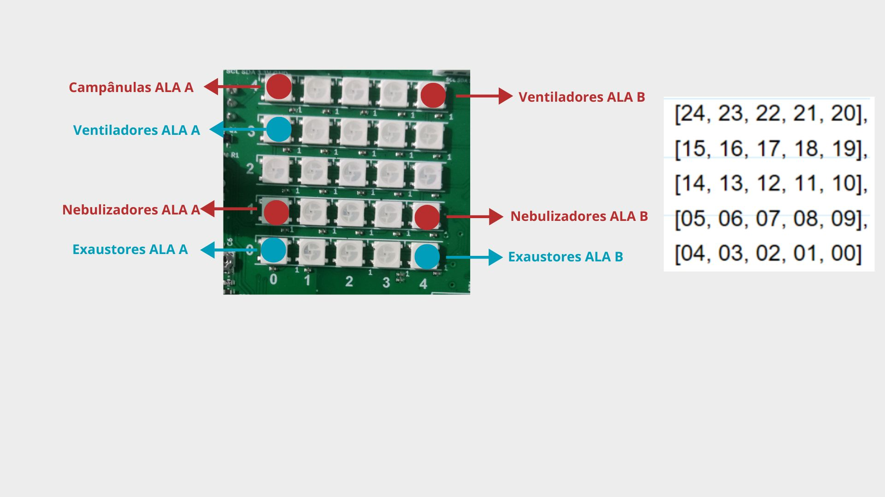

# Atividade - Unidade 7 Capítulo 1

## Resumo 📝

Projeto final do programa EmbarcaTech, desenvolvido para fins avaliativos da fase de capacitação. O projeto simula o monitoramento e controle de temperatura e umidade em um aviário, com o objetivo de garantir o bem-estar dos animais e a qualidade da produção.

## Vídeo de apresentação 🎥

[Vídeo de apresentação do projeto](video_link_)

## Funcionalidades 🚀

- **Medição e Exibição:**

  - Realiza leitura dos valores do joystick (usado como entrada analógica) para simular os sensores de temperatura e umidade.
  - Exibe as medições no display OLED SSD1306, com informações diferenciadas conforme o modo de operação (temperatura ou umidade).

- **Controle de Atuadores:**

  - No modo de temperatura:
    - Se a temperatura da ala A for menor que 29 °C, liga campânulas .
    - Se a temperatura da ala A for maior que 33 °C, aciona os ventiladores.
    - Para a ala B, se a temperatura ultrapassar 28 °C, ligam os ventiladores.
  - No modo de umidade:
    - Se a umidade da ala A ou B for menor que 50%, liga os nebulizadores.
    - Se a umidade da ala A ou B for maior que 70%, aciona os exaustores.

- **Alternância de Modos:**
  - Um botão (BUTTON_A) permite alternar entre o modo de monitoramento de temperatura e o modo de monitoramento de umidade através de uma interrupção no GPIO.

## Sensores e Atuadores 🔌

- **Sensores de Temperatura:**

  - Eixo X do Joystick: Simula o sensor de temperatura na ala A.
  - Eixo Y do Joystick: Simula o sensor de temperatura na ala B.

- **Sensores de Umidade:**

  - Eixo X do Joystick: Simula o sensor de umidade na ala A.
  - Eixo Y do Joystick: Simula o sensor de umidade na ala B.

    - **Sensor DHT11 (Temperatura e Umidade):**

- **Atuadores:**

- Campânulas ala A (LED vermelho 24): Ligadas quando a temperatura da ala A é menor que 29 °C.
- Ventiladores ala A (LED azul 15): Ligados quando a temperatura da ala A é maior que 33 °C.
- Ventiladores ala B (LED vermelho 20): Ligados quando a temperatura da ala B é maior que 28 °C.

---

- Nebulizadores ala A (LED vermelho 5): Ligados quando a umidade da ala A é menor que 50%.
- Exaustores ala A (LED azul 4): Ligados quando a umidade da ala A é maior que 70%.
- Nebulizadores ala B (LED vermelho 9): Ligados quando a umidade da ala B é menor que 50%.
- Exaustores ala B (LED azul 0): Ligados quando a umidade da ala B é maior que 70%.
  - **Relés 5V:**



## Estrutura do Projeto

- **TAREFA-U7C1.c:**  
  Código principal, responsável pela inicialização dos periféricos, leitura dos sinais de ADC (joystick), gerenciamento do modo de operação (temperatura ou umidade) e chamada das funções de controle de atuadores e atualização do display.

- **libs/src/display_draw.c:**  
  Funções para desenhar no display OLED, incluindo a configuração inicial, desenho de linhas de separação e exibição dos valores de temperatura e umidade para os setores A e B.

- **libs/src/actuators.c:**  
  Lógica de controle dos atuadores. Aciona dispositivos (lâmpadas, ventiladores, nebulizadores e exaustores) com base nos intervalos de temperatura e umidade predefinidos para os setores A e B.

- **libs/src/pioconfig.c:**
  Funções para inicializar a máquina de estado que controla a matriz de LEDs 5x5.

- **libs/src/ssd1306.c:**
  Funções para inicializar e controlar o display OLED SSD1306 e exibir informações no display.

- **libs/src/temperature_humidity.c:**
  Lógica para aumentar ou diminuir a temperatura e humidade, conforme a posição do eixo X e Y do joystick.

## Como executar o projeto 🛠️

1.  **Configuração do Ambiente:**

    - Certifique-se de ter o SDK do Raspberry Pi Pico instalado e configurado corretamente.
    - Configure as ferramentas de compilação (CMake, etc.).

2.  **Clone o repositório**
    ```
    git clone https://github.com/jacks0nsilva/U7T_TIC370100210_JACKSON
    ```
3.  **Instale a extensão do Raspberry Pi Pico no seu VsCode**
4.  **Usando a extensão do Raspberry Pi Pico, siga os passos:**
5.  **Clean CMake: Para garantir que o projeto será compilado do zero**

6.  **Compile Project: Compilação dos binários**

7.  **Run Project [USB]: Compila e copia o firmware para a placa automaticamente**
